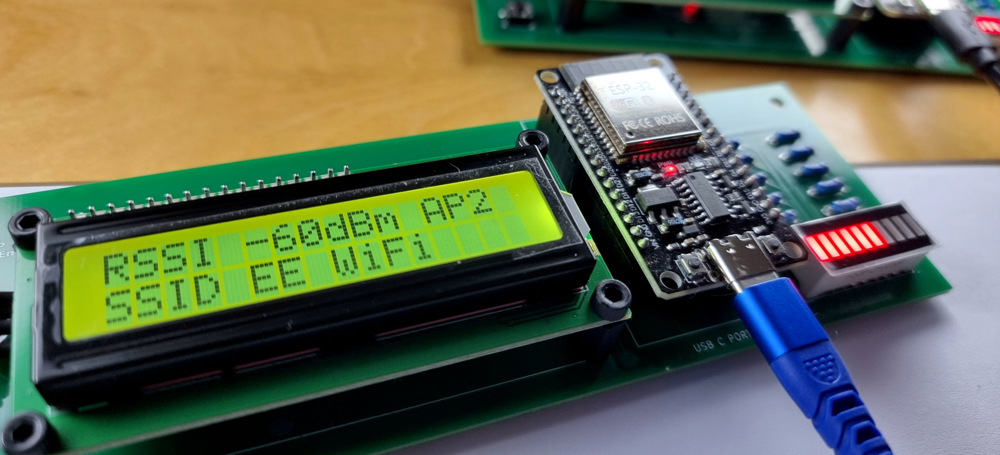

# Spectrum One

Spectrum One is a compact ESP32-based WiFi activity monitor that visualises nearby WiFi activity using a 16×2 LCD and a 10-segment LED bar.

  

It works by running repeated WiFi scans and turning the results into something you can actually see — live signal bars, changing numbers, blinking LEDs. The values shown are derived from WiFi RSSI and are meant for visualisation and comparison, not calibrated RF measurement.

This repository contains the reference implementation of the device.

---

## Open Hardware Certification

**OSHWA UID:** UK000086  
**Full record:** CERTIFICATION.md  
**Certified hardware version:** 0.1.0

---

## About the Book — Second Edition (Free)

The book that accompanies this project documents the full development of Spectrum One — from early breadboard experiments through to a finished, certified PCB design. It covers hardware design decisions, firmware behaviour, display logic, and the messy reality of turning a prototype into something reproducible.

The second edition is now available as a **free download** in PDF and EPUB:

### 📖 [Download the book — currenari.com/spectrum-one](https://currenari.com/spectrum-one/)

**ESP32 WiFi Activity Monitor: Spectrum One – From Breadboard Prototype to Custom PCB**  
*by Jay J. Reszka*

This second edition is licensed under **Creative Commons Attribution–NonCommercial–ShareAlike 4.0 (CC BY-NC-SA 4.0)**. You're free to share and adapt the text for non-commercial purposes, as long as you give appropriate credit and share any derivative work under the same licence.

---

## Repository Contents

The repository is organised by release version and contains:

**binaries/** — Versioned reference firmware binaries for flashing Spectrum One hardware.

**firmware/** — ESP-IDF firmware source code.

**hardware/** — KiCad schematics, PCB layouts, symbols, footprints, and fabrication outputs.

**docs/** — Repository documentation and technical notes.

**media/** — Images and diagrams used by the repository documentation.

---

## What This Repository Does Not Contain

This repository intentionally does not include book text, manuscripts, instructional chapters, or book-specific photography and artwork. Those live with the published book itself — grab it from the link above.

---

## Hardware Assembly

Minimal assembly documentation is included here to support reproduction of the open hardware design.

General assembly information is provided in `ASSEMBLY.md` at the repository root. Version-specific assembly notes are located under `hardware/v0.1.0/ASSEMBLY.md`.

For full system design context and step-by-step development notes, see the book.

---

## Licensing

Licensing is separated by material type:

**Firmware source code and binaries** — MIT License

**Hardware design files** — CERN Open Hardware Licence v2.0 – Strongly Reciprocal (CERN-OHL-S-2.0)

**Repository documentation and media** — Creative Commons Attribution 4.0 International (CC BY 4.0)

**Book (second edition)** — Creative Commons Attribution–NonCommercial–ShareAlike 4.0 International (CC BY-NC-SA 4.0). Free download at [currenari.com/spectrum-one](https://currenari.com/spectrum-one/)

Full licensing terms are defined in `LICENSE.md`.
