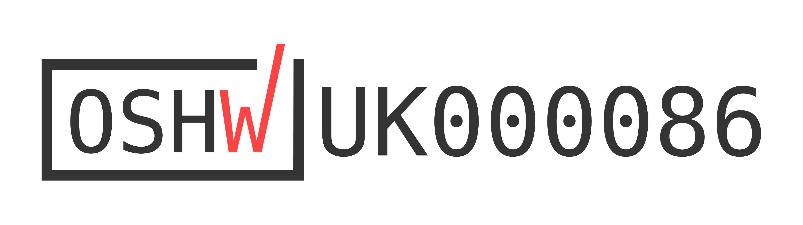

# Spectrum One

Spectrum One is a compact ESP32-based WiFi activity monitor that visualises nearby WiFi activity using a 16×2 LCD and a 10-segment LED bar.

It works by running repeated WiFi scans and turning the results into something you can actually see — live signal bars, changing numbers, blinking LEDs. The values shown are derived from WiFi RSSI and are intended for visualisation and comparison, not calibrated RF measurement.

This repository contains the reference implementation of the device.

---

## Open Hardware Certification

**OSHWA UID:** UK000086  
Full record: `CERTIFICATION.md`  
Certified hardware version: 0.1.0

---

## Repository Contents

The repository is organised by release version and contains:

**binaries/**  
Versioned reference firmware binaries for flashing Spectrum One hardware.

**firmware/**  
ESP-IDF firmware source code.

**hardware/**  
KiCad schematics, PCB layouts, symbols, footprints, and fabrication outputs.

**docs/**  
Repository documentation, technical notes, and [ESP32 WiFi Activity Monitor PDF Book (Direct Download)](https://github.com/currenari/spectrum-one/raw/main/docs/ESP32%20WiFi%20Activity%20Monitor.pdf).

**media/**  
Images and diagrams used by the repository documentation.

---

## Hardware Assembly

This repository provides assembly documentation sufficient to reproduce the open hardware design.

General assembly information is provided in:

`ASSEMBLY.md`

Version-specific assembly notes are located under:

- `hardware/v0.1.0/ASSEMBLY.md`

---

## Project Scope

This repository contains the open hardware design files, firmware source code, reference binaries, and technical documentation required to reproduce Spectrum One.

Extended development notes and technical writing are published at:

https://currenari.com

---

## Licensing

Licensing is separated by material type:

- **Firmware source code and binaries**  
  MIT License

- **Hardware design files**  
  CERN Open Hardware Licence v2.0 – Strongly Reciprocal (CERN-OHL-S-2.0)

- **Repository documentation and media**  
  Creative Commons Attribution 4.0 International (CC BY 4.0)

Full licensing terms are defined in `LICENSE.md`.