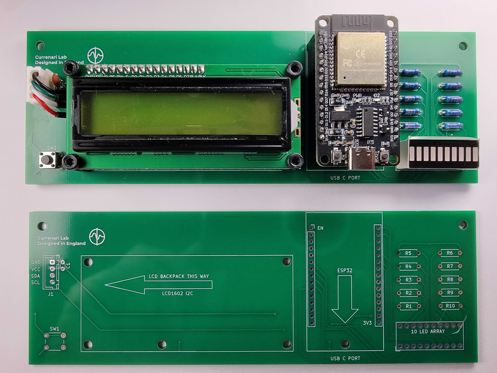
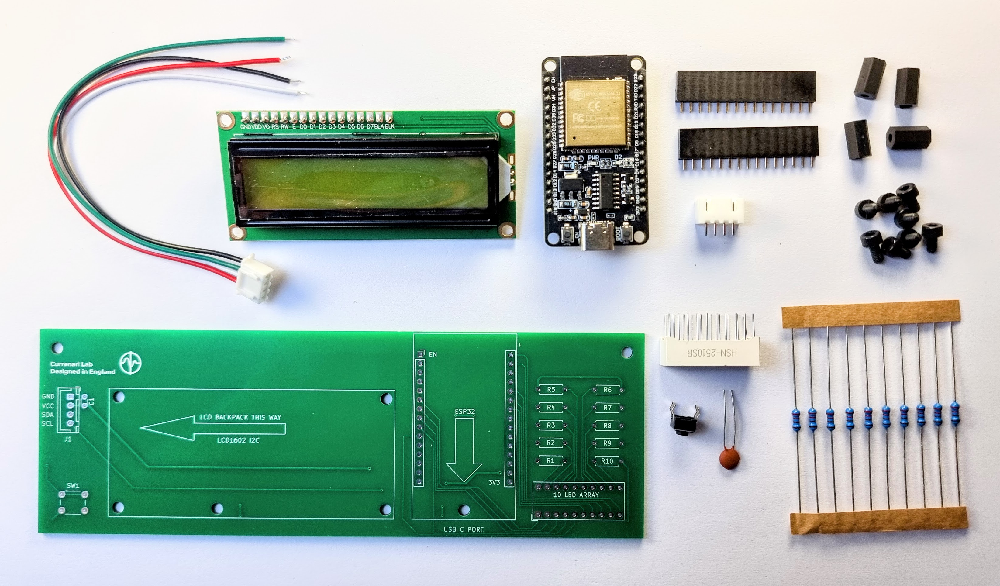

# Spectrum One PCB Assembly v0.1.0

This file documents physical assembly details for the Spectrum One PCB (v0.1.0).

## Assembly Scope
PCB-level assembly only.
Firmware, system behaviour, and usage are out of scope.

## Board
- 2-layer FR4 PCB
- Power supplied via ESP32 module USB-C connector (5 V)
- 3.3V logic

## Components
- ESP32 development module (30-pin)
- LCD1602 I2C header (J1)
- LED resistors R1–R10
- User switch SW1

## Orientation
- ESP32 module orientation follows silkscreen outline and arrow
- LCD header orientation follows silkscreen marking
- Polarised parts follow PCB markings
- Resistors are non-polarised

## Reference Files
- PCB layout: `pcb/`
- Schematic: `schematic/`
- Footprints: `footprints/`
- Symbols: `symbols/`
- Gerbers: `gerbers/`
- BOM: `BOM.md`

## Assembly Reference Images

### Assembled PCB

This image shows a fully assembled Spectrum One PCB for hardware version v0.1.0.
It is provided as a placement and orientation reference.

### Reference Parts Set

This image shows the physical components used in the reference build.
Equivalent parts with matching specifications may be used.
